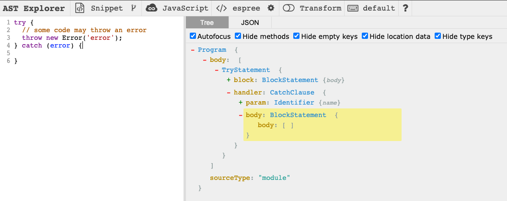

# How to write a custom ESLint Rule?

## Background

Recently we do some refactoring about our system, and we found that we need to control the store dispatch direction, which is right from the sub-application to the main application.

And therefore, dispatching an action from the main application to the sub-application is not allowed because this will couple the applications. After we discussed this problem, we found that one way to do this is to implement lexical analysis to check the dispatch/commit direction and give a warning to our system's developers.

As you may notice, we need to implement lexical analysis and we found ESLint is a great tool to do this. So today's topic is how to create a custom ESLint rule. I'll walk you through writing a rule step by step so that you can create your own rules.

## Get Started

For writing custom ESLint rules for your project, you will need to do the following things:

1. Integrated [eslint-plugin-local-rules](https://github.com/cletusw/eslint-plugin-local-rules)
2. Create your custom rules
3. Update ESLint configuration
4. Run Command: `eslint --ext .js,.vue ./src` to check your code

Looks quite simple, let's check it step by step.

## Integrated eslint-plugin-local-rules

```bash
npm install eslint-plugin-local-rules
```

## Create your custom rules

Define your custom rules and export them in `eslint-local-rules/index.js` file.

### Define your custom rules

At /eslint-local-rules folder

```js
// /eslint-local-rules/disallow-empty-catch.js
'use strict';

module.exports = {
  meta: {
    messages: {
      emptyCatch: 'Empty catch block is not allowed.',
    },
  },
  create(context) {
    return {
      CatchClause(node) {
        if (node.body.body.length === 0) {
          context.report({ node: node.body, messageId: 'emptyCatch' });
        }
      }
    }
  }
}

```

### Export them in `eslint-local-rules/index.js` file

```js
// /eslint-local-rules/index.js
'use strict';

const disallowEmptyCatch = require('./disallow-empty-catch');

module.exports = {
  "disallow-empty-catch": disallowEmptyCatch,
};
```

## Update ESLint configuration

```js
// .eslintrc.js
module.exports = {
  // ...
  "plugins": [
    "eslint-plugin-local-rules",
  ],
  "rules": {
    "local-rules/disallow-empty-catch": 2,
  }
}
```

Okay, now you may have a question, how do you know you need to use `node.body.body.length` to decide whether the catch block is empty or not?

The answer is that you need to read the [AST](https://eslint.org/docs/developer-guide/working-with-rules#working-with-the-ast) of the code.

AST is a tree representation of the source code that tells us about the code structure.

Tools like ESLint create AST for a given piece of code and execute rules on it.

To figure out specific instructions for our custom rule, we need to inspect AST manually.

You can use [AST explorer](https://astexplorer.net/) to check the AST of your code.

Let's check the AST of the following code:

```js
try {
  // some code may throw an error
  throw new Error('error');
} catch (error) {}
```

If we leave the catch block empty, it will silently swallow an error, and such an error is very hard to trace.

Let's have a look at the AST of the above code: [Link](https://astexplorer.net/#/gist/f8a2a6445e2609c812d6fa41ae34caf4/7c0629c34fcf198a08714d26fbb5d6f4800a9c5a)



We could start from the top-level `Program` node and navigate downwards but the chain is too long. we can start at the node `CatchClause`

you can also start at the node `TryStatement`

```js
TryStatement(node) {
  if (node.handler && node.handler.body.body.length === 0) {
    context.report({ node: node.handler.body, messageId: 'emptyCatch' });
  }
}
```

But it’s better to choose something closer to our target node, just like `CatchClause`.

Then we run `yarn lint`, it will give us an error message:

```bash
error: Empty catch block is not allowed (local-rules/disallow-empty-catch) at src/main.js:13:14:
> 13 | } catch (error) {}
  14 |
```

## Vuex Case

let's take another look at the case we mentioned in the background part.

We want some `vuex` modules that can only be dispatched from the sub-application to the main application. Following the statement above, we can write a custom rule like this:

```js
// context.options
"rules": {
  "local-rules/disallow-some-module": [
    2,
    [
      'aModule',
    ]
  ]
}

```

```js
// /eslint-local-rules/disallow-some-module.js
module.exports = {
  create(context) {
    const options = context.options[0] || [];
    return {
      'CallExpression[callee.type="Identifier"][callee.name="mapGetters"]': function (node) {
        const arg = node.arguments[0];
        if (options.includes(arg.value)) {
          context.report({
            node: node.arguments[0],
            message: `mapGetters: not allowed to use ${arg.value}`,
          });
        }
      },
      'CallExpression[callee.type="Identifier"][callee.name="mapActions"]': function (node) {
        const arg = node.arguments[0];
        const { properties } = arg;
        properties.forEach((property, index) => {
          const { value } = property.value;
          if (options.includes(value.split('/')[0])) {
            context.report({
              node: node.arguments[0].properties[index].value,
              message: `mapActions: not allowed to use ${value.split('/')[0]}`,
            });
          }
        });
      }
    };
  },
};
```

And then you run `yarn lint` again, the error messages will be:

```bash
error: mapGetters: not allowed to use aModule (local-rules/disallow-some-module) at src/App.vue:13:19:
  11 |   name: 'App',
  12 |   computed: {
> 13 |     ...mapGetters('aModule', ['loadAModuleNumber']),
     |                   ^
  14 |   },
  15 |   async created() {
  16 |     await this.loadAModule();


error: mapActions: not allowed to use aModule (local-rules/disallow-some-module) at src/App.vue:20:20:
  18 |   methods: {
  19 |     ...mapActions({
> 20 |       loadAModule: 'aModule/loadAModule',
     |                    ^
  21 |       loadBModule: 'bModule/loadBModule',
  22 |     }),
  23 |   },
```

It works! And we can also detect the specific program patterns to provide powerful constraints.

For example:

```js
this.$store.commit('aModule/commitAModule');
this.$store.dispatch('aModule/dispatchAModule');
```

## Conclusion

In this article, we have learned how to use AST explorer to help and finally write a custom ESLint rule for our scenarios.

ESLint shows us a solution to handle some scenarios:

- Enforced some coding styles base on our technical implements and architecture conventions.
- Detected and auto-fixed some specific programming patterns, like the i18n solution in our project.

## Further Reading

- [how-to-write-custom-eslint-rules](https://developers.mews.com/how-to-write-custom-eslint-rules/)
- [ESLint configuration](https://eslint.org/docs/latest/user-guide/configuring/)
